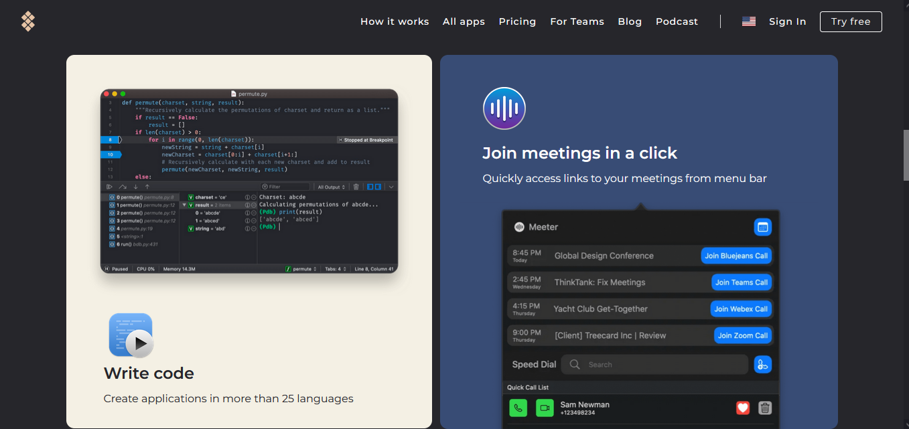
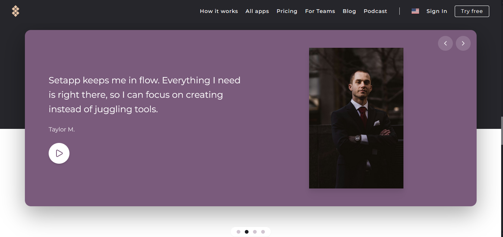

## Setapp Landing (React + Tailwind + Vite)

Live: https://react-tailwindcss-test-assignment.onrender.com/

High-fidelity landing page built from Figma, featuring hero, feature grid, dual testimonial carousels, CTA, and a multi-column footer. Responsive, accessible, and deploy-ready on Render with SPA-friendly rewrites.

### Preview





### Highlights

- Pixel-perfect sections from the provided Figma: hero, feature grid, testimonial carousel, Setapp social carousel, CTA card, footer.
- Embla-powered carousels with dots/arrows, responsive breakpoints, and accessible controls.
- Scroll-to-top on route/hash change for smooth navigation.
- Render-ready SPA rewrites so deep links refresh correctly.

### Tech Stack

- React 19 + Vite
- Tailwind CSS
- embla-carousel-react (+ autoplay)
- framer-motion (optional animations) - Not implemented due to time constraints
- react-router-dom

### Getting Started

```bash
git clone <repo>
cd react-tailwindcss-test-assignment
npm install

# Start dev server
npm run dev

# Build for production
npm run build

# Preview production build locally
npm run preview
```

### Deployment (Render)

- Ensure SPA rewrite: add `_redirects` in `public/` with `/*    /index.html   200` (or `static.json` with `{ "routes": { "/*": "index.html" } }`).
- Deploy the Vite build output (`dist`) via Render’s static site.

### Structure (key pieces)

- `src/components/` — hero, feature grid, testimonial carousels, CTA, footer, scroll-to-top helper.
- `public/preview*.PNG` — visual previews used above.

### Notes

- Animations are minimal and opt-in; keep them transform/opacity-only for performance and accessibility.
- Fonts and colors follow the Figma spec; adjust in `tailwind.config.js` if needed.
